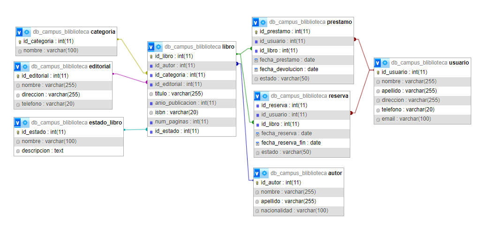

# filtro Biblioteca Campus

## Descripcion
---
- Proyecto realizado para la gestion de prestamos de libros de una biblioteca.
---

---
## Diagrama Entidad Relacion
---

---
## Modo de uso:
---
1. Clonar el repositorio en su dispositivo
2. Ingresar a la carpeta backend > scripts y seleccionar el archivo script_database 
3. Ejecutar paso a paso el archivo para crear la base de datos de manera local, para esto recuerde que primero debe seguir los siguientes pasos:
   - 3.1. Corrobore tener Apache y Mysql instalados y corriendo en su ordenador
   - 3.2. Ejecute el comando "mysql -u root -p;"
   - 3.3. Si no muestra ningun error, Ejecute el comando "SHOW DATABASES;" y asegurese de no tener ninguna base de datos con el nombre "db_campus_bliblioteca"
   - 3.4. Ahora ejecute uno a uno los comandos del archivo scriptDatabase
4. Revise que las configuraciones del archivo .env coincidan con las de su ordenador, si no es el caso cambielas
5. Abra un nuevo bloque de comandos desde el archivo del repositorio, si esta usando visual estudio puede hacerlo desde la pestaña terminal > new terminal
6. Con el comando "cd backend"  ingrese a la carpeta backend
7. Ejecute el comando "npm install"
8. Ejecute el comando "npm run dev"
9. La consola le mostrara la direccion http donde esta corriendo el servidor, la cual de manera predeterminada es "http://127.9.63.7:5000"
10. Para interactuar con los enpoints es recomendable usar una extension como Thunder Client, para ello siga los siguientes pasos:
   - 10.1. Descarge la extension Thunder Client desde visual studio code
   - 10.2. En el panel izquierdo seleccione la extension Thunder Client y posteriormente en new request
   - 10.3. Coloque la url en el panel de direccion de Thunder Client con el endpoint especifico
   - 10.4. Seleccione el metodo de la peticion segun corresponda
   - 10.5. Si es un metodo POST envie un objeto en formato JSON con la informacion requerida en la pestaña body de Thunder Client

---
## Consultas SQL
---
La api desde el script de la base de datos contiene datos predeterminados como el tipo de cita, el estado de la cita, el genero entre otros, sin embargo, estos datos pueden ser modificados desde los diferentes endpoints que proporciona la api.

2. Obtener todos los autores y su nacionalidad
    - URL: http://127.9.63.7:5000/api/get/autores
    - Método: GET
    - Lectura de Datos: 
    - Ejemplo: http://127.9.63.7:5000/api/get/autores

3. listar todas las categorias disponibles
    - URL: http://127.9.63.7:5000/api/get/categorias
    - Método: GET
    - Lectura de Datos: 
    - Ejemplo: http://127.9.63.7:5000/api/get/categorias

4. Mostrar todas las editoriales y sus direcciones
    - URL: http://127.9.63.7:5000/api/get/editoriales
    - Método: GET
    - Lectura de Datos: 
    - Ejemplo: http://127.9.63.7:5000/api/get/editoriales

5. Obtener los estados de los libros y sus descripciones
    - URL: http://127.9.63.7:5000/api/get/estadoLibros
    - Método: GET
    - Lectura de Datos: 
    - Ejemplo: http://127.9.63.7:5000/api/get/estadoLibros

6. Mostrar todos los libros con su titulo
    - URL: http://127.9.63.7:5000/api/get/libros
    - Método: GET
    - Lectura de Datos: query
    - Ejemplo: http://127.9.63.7:5000/api/get/libros.

7. Listar los prestamos realizados con fecha
    - URL: http://127.9.63.7:5000/api/get/prestamos
    - Método: GET
    - Lectura de Datos: query
    - Ejemplo: http://127.9.63.7:5000/api/get/prestamos

8. Obtener todas las reservas realizzadas con su fecha
    - URL: http://127.9.63.7:5000/api/get/reservas
    - Método: GET
    - Lectura de Datos: query
    - Ejemplo: http://127.9.63.7:5000/api/get/reservas

9. Mostrar los libros disponibles para prestamos con su titulo
    - URL: http://127.9.63.7:5000/api/get/libros
    - Método: GET
    - Lectura de Datos: query
    - Ejemplo: http://127.9.63.7:5000/api/get/libros?estado=Disponible
    - Descripción: Se debe poner el estado=Disponible en el query.

10. Obtener los libros prestados y su fecha de devolucion
    - URL: http://127.9.63.7:5000/api/get/libros
    - Método: GET
    - Lectura de Datos: query
    - Ejemplo: http://127.9.63.7:5000/api/get/libros?estado=Prestado
    - Descripción: Se debe poner el estado=Prestado en el query.

11. Listar los usuarios y sus correos electronicos
    - URL: http://127.9.63.7:5000/api/get/usuario
    - Método: GET
    - Lectura de Datos: query
    - Ejemplo: http://127.9.63.7:5000/api/get/usuario
12. 
13. 
14. 
15. 
16. 
17. 
18. 

---
# Creador:
## Andrès David ELizalde Peralta
---
